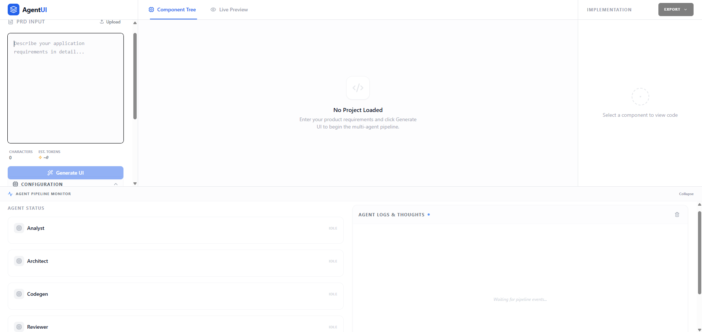
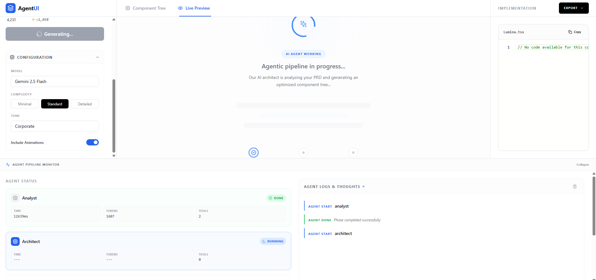
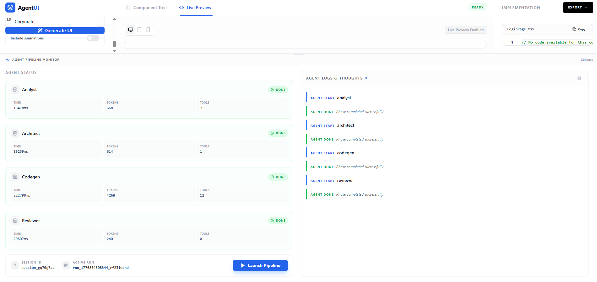
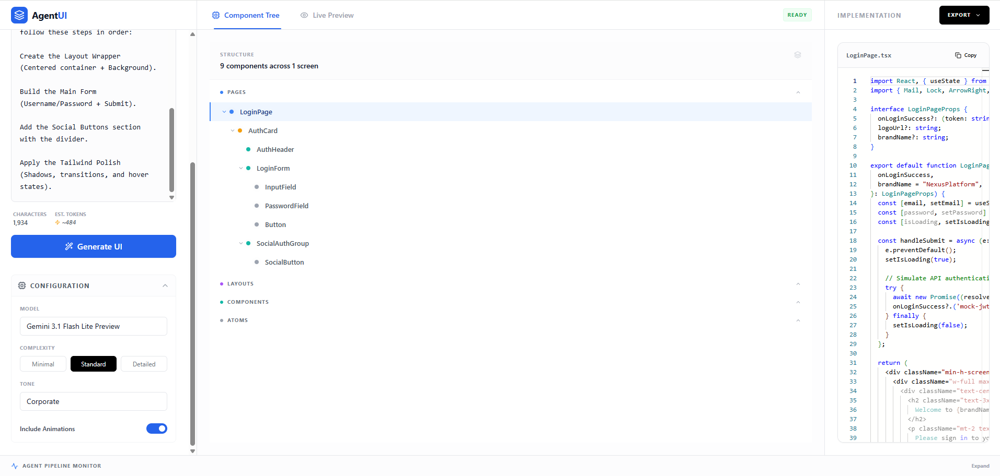
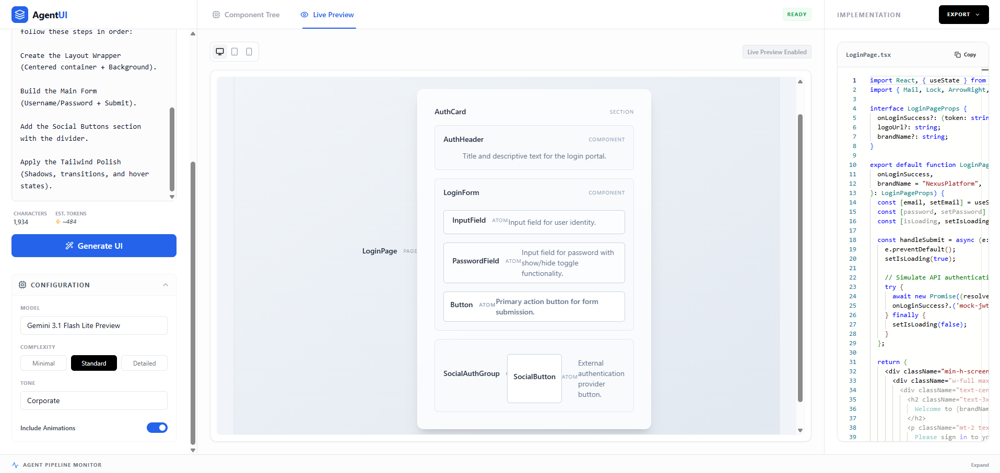
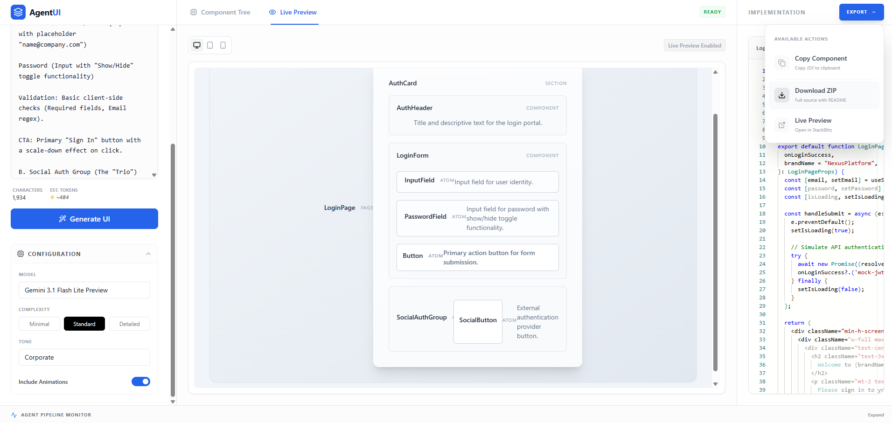
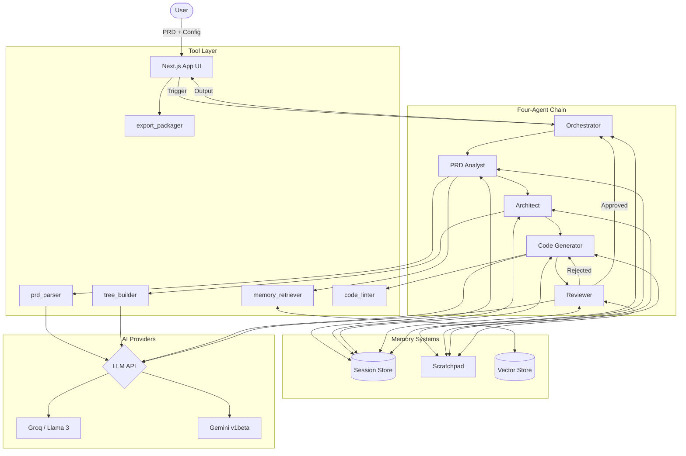

# SpecToUIAgent

`SpecToUIAgent` is an agentic PRD-to-React pipeline that converts product requirements into a component tree, generated TSX, live preview output, and exportable project artifacts.

---

## Screenshots 

1. [App without PRD input] 
    

2. [App agent running]
    

3. [App agent pipeline status]
    

4. [App output with component tree]
    

5. [App output with Live preview]
    

6. [App output template code exporter]
    

## Architecture Flow



## Four-agent chain

```text
[PRD] → [Analyst] → [Architect] → [CodeGen] → [Reviewer] → [Output]
```

- **Agent 1 (PRD Analyst)**  
  Reads raw PRD text, retrieves similar past PRDs from memory, calls the PRD parser tool, and writes `parsedPrd` into session memory.  
  - Tools called: `memory_retriever`, `prd_parser`  
  - Memory writes: `session.parsedPrd`, scratchpad thought entries

- **Agent 2 (Architect)**  
  Reads the parsed PRD and analyst scratchpad context, calls the component tree builder tool, and stores a `ComponentNode` tree in session memory.  
  - Tools called: `component_tree_builder`  
  - Memory writes: `session.componentTree`, scratchpad thought entries

- **Agent 3 (Code Generator)**  
  Walks the component tree leaves and generates TSX with an internal lint-and-retry loop. Supports specialized instructions for React + Tailwind components.  
  - Tools called: `code_linter` (inside iterative loop)  
  - Memory writes: `session.generatedCode` map (component name/id → TSX)

- **Agent 4 (Reviewer)**  
  Reviews generated output for UX and logic consistency. Returns `overallScore`, `issues`, and `approved`. If rejected, orchestrator runs a targeted revision cycle.  
  - Robustness: Uses specialized JSON extraction to handle various model output styles.

## Dynamic Pipeline Intelligence

- **Flexible Model Support**  
  The system supports high-performance Llama 3 models (via Groq) and the latest Google Gemini models (via `v1beta` API).
- **Lite Model Resilience**  
  Smaller models (e.g., Gemini Flash Lite) often provide messy or markdown-wrapped JSON. The system implements a robust extraction layer (`lib/ai/utils.ts`) to maintain stability across different model tiers.
- **Detailed Error Diagnostics**  
  The pipeline surfaces granular feedback on safety filters, rate limits, and model service status (503s), helping users adjust their prompts or model selection.

## Tool catalog

| Tool | One-line description | Called by agent | Input → Output |
| --- | --- | --- | --- |
| `prd_parser` | Converts raw PRD text into structured JSON (`ParsedPrd`) | Analyst | `{ prdText }` → `{ appName, screens, roles, features, entities }` |
| `memory_retriever` | Retrieves similar past PRDs from vector memory | Analyst | `{ prdText }` → `VectorEntry[]` |
| `component_tree_builder` | Builds hierarchical UI component tree from parsed PRD | Architect | `ParsedPrd` → `ComponentNode` |
| `code_linter` | Scores generated TSX and reports structural/style issues | Code Generator | `{ code }` → `{ valid, issues, score }` |
| `export_packager` | Packages generated output as ZIP or StackBlitz payload | UI/Export flow | `{ result, format }` → export metadata/payload |

---

## Full directory tree

```text
SpecToUIAgent/
├── app/                                  # Next.js App Router UI + API entrypoints
├── agents/                               # Pipeline agent implementations
├── tools/                                # Typed tool layer used by agents
├── components/                           # UI components grouped by feature
├── lib/
│   ├── ai/                               # LLM wrappers + prompts
│   │   ├── groq.ts                       # Groq Llama 3 integration
│   │   ├── gemini.ts                     # Gemini integration (v1beta)
│   │   ├── utils.ts                      # Robust JSON extraction & utilities
│   │   └── prompts.ts                    # Centralized system prompts
│   └── export/                           # Export adapters/utilities
├── memory/                               # Session, vector, and scratchpad stores
├── types/                                # Shared TS contracts
├── package.json                          # Scripts + dependencies
├── tsconfig.json                         # TypeScript configuration
└── tailwind.config.ts                    # Tailwind configuration
```

## Key design decisions

- **Separate files per agent (single responsibility):** each stage has a clear contract, isolated prompts/tools, and easy unit/integration targeting.
- **Typed tool schemas:** tools define explicit input/output schemas for validation, safe composition, and testability.
- **AsyncGenerator pipeline:** orchestrator streams events in real-time (agent start/done/thought/error), supports cancellation, and maps naturally to SSE in the UI.
- **Robust Output Handling:** Shared JSON extraction handles non-standard LLM responses, ensuring consistent parsing across all agents.

## UI Capabilities

- **3-Panel Shell**: Interactive PRD editor, hierarchical component explorer, and real-time live preview.
- **Resizable Pipeline Monitor**: The bottom monitor panel is vertically draggable, allowing you to scale the visibility of agent interactions and logs.
- **Live Preview Tabs**: Switch between component-tree nodes and a rendered live preview of the entire app structure.

## Setup instructions

### Prerequisites

- Node.js 18+
- API key for **Google Gemini** (AI Studio) or **Groq**

### Installation and run

```bash
git clone <repo>
cd SpecToUIAgent
npm install
cp .env.example .env.local
# Fill in GEMINI_API_KEY (AI Studio) and/or GROQ_API_KEY
npm run dev
# Open http://localhost:3000
```

### Supported Models

| Provider | Models |
| --- | --- |
| **Google Gemini** | `gemini-2.5-flash`, `gemini-3.1-flash-lite-preview` |
| **Groq** | `llama-3.3-70b-versatile` |

---

## Architecture decisions

### Why four agents instead of one big prompt

- **Separation of concerns:** each agent solves one clear problem (analysis, planning, generation, review).
- **Smaller prompts improve determinism:** narrower tasks reduce output drift and schema breakage.
- **Built-in QA loop:** reviewer enables machine feedback and targeted revision without manual review in the common path.

### Why vector memory

- Past PRDs influence future runs, improving contextual accuracy over time.
- Production path can swap in persistent vector engines behind the same retrieval interface.
